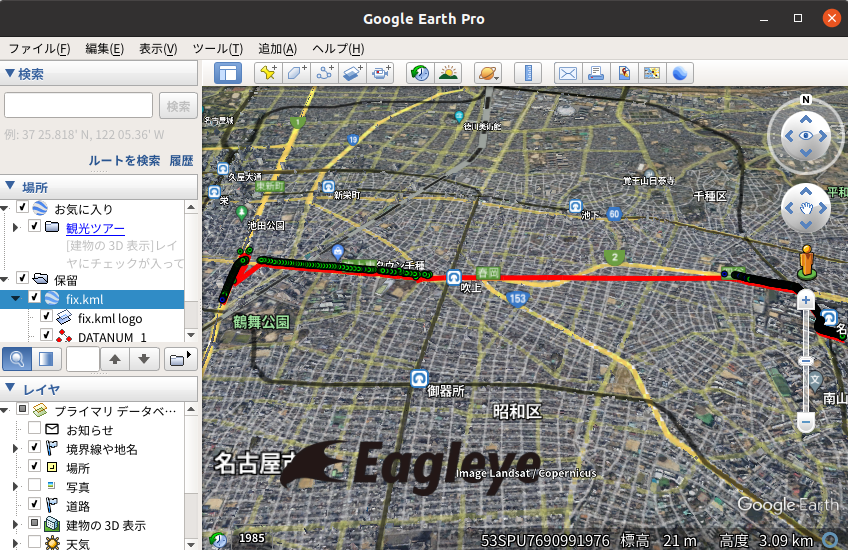
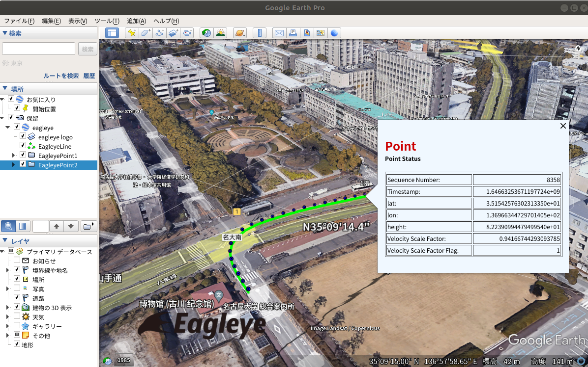

# kml_generator

kml_generator is a package for easily creating KML files.
Please see the sample program example below for how to use it.
Also see the public functions of the kml_generator class.
https://github.com/MapIV/kml_generator/blob/main/include/kml_generator/kml_generator.hpp#L37-L68

# example

## NavSatFix
[fixcsv2kml.cpp](sample/fixcsv2kml.cpp) is a sample program to convert NavSatFix type ROS message vectors into kml files.
```
roscd kml_generator/data
rosrun kml_generator fixcsv2kml fix.csv fix.kml
```

The fix.csv was generated with the command "rostopic echo -b bag_name.bag -p /topic_name > fix.csv".

<br>

## Eagleye
[eagleyelogcsv2kml.cpp](sample/eagleyelogcsv2kml.cpp) is a sample program for putting your own information into points.

```
roscd kml_generator/data
rosrun kml_generator eagleyelogcsv2kml eagleye_log.csv eagleye_log.kml
```
The eagleye_log.csv was generated by [eagleye_pp](https://github.com/MapIV/eagleye/tree/main-ros1/eagleye_pp).

<br>

This sample program converts a vector of struct kml_utils::Point into a kml file.

https://github.com/MapIV/kml_generator/blob/main/include/kml_generator/kml_generator.hpp#L12-L32

```
namespace kml_utils
{
struct OtherInfo
{
  std::string name; // ex) name = "Velocity Scale Factor"
  std::string value_str; // ex) value_str = "0.987684"
};

struct Point
{
public:
  int seq = 0; // [sequence number]
  double time;      // [sec]
  double latitude;  // [deg]
  double longitude; // [deg]
  double altitude;  // [m]

  std::vector<OtherInfo> other_info_vector;
};

```


