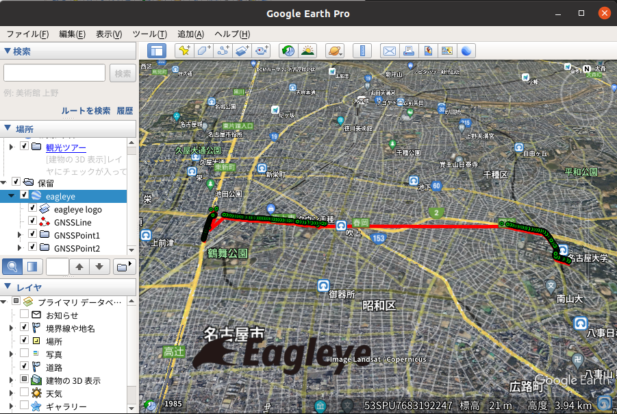

# kml_generator

# example

## NavSatFix
```
roscd kml_generator/data
rosrun kml_generator fixcsv2kml fix.csv fix.kml
```

The fix.csv was generated with the command "rostopic echo -b bag_name.bag -p /topic_name > fix.csv".

<br>

## Eagleye
eagleyelogcsv2kml.cpp is a sample program for putting your own information into points.

```
roscd kml_generator/data
rosrun kml_generator eagleyelogcsv2kml eagleye_log.csv eagleye_log.kml
```